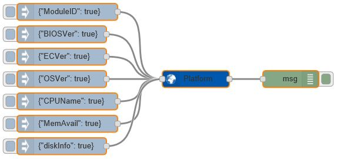

# node-red-contrib-atplatform
A collection of [Node-RED](http://nodered.org) nodes for Advantech IIoT platform common information.

Notice that an Advantech IIoT Platform SDK have to be installed to make this node works correctly.
Advantech IIoT Platform SDK download link is shown below:

Windows:
  https://github.com/Advantech-IIoT/Platform-SDK/tree/master/windows/bin

Linux:
  https://github.com/Advantech-IIoT/Platform-SDK/tree/master/linux/bin

## Installation
Use npm command to install this package locally in the Node-RED modules directory
```bash
npm install node-red-contrib-atplatform
```
or install it globally with the command
```bash
npm install node-red-contrib-atplatform -g
```

## Usage
Platform common Node-RED node provide one node in this package.
 - Platform

The following information can be got from `Platform` node:
 - Module ID
 - BIOS version
 - EC version
 - OS version
 - CPU model name
 - COM ports
 - Memory available
 - Disk information

 ### Example
Please refer to [demo.json](./demo.json).  
  
 - Input anything to `Platform` node for triggering it to print platform information (use the topic selected from node-red UI).
 - Input `{"All": true}`, or `{"OSVer":true}`, or others in `msg.payload` to `Platform` node for triggering it to print platform information (use the topic selected from user input string).

## Test Platform
 - Windows 10 Enterprise LTSC with node.js 18.14.1

## History
 - 4.0.1 - June 2023 : update bundleDependencies
 - 3.2.0 - June 2020 : Add network functions
 - 1.1.5 - October 2017 : Initial Release

## License
Copyright 2023 ADVANTECH Corp. under [the Apache 2.0 license](LICENSE).
